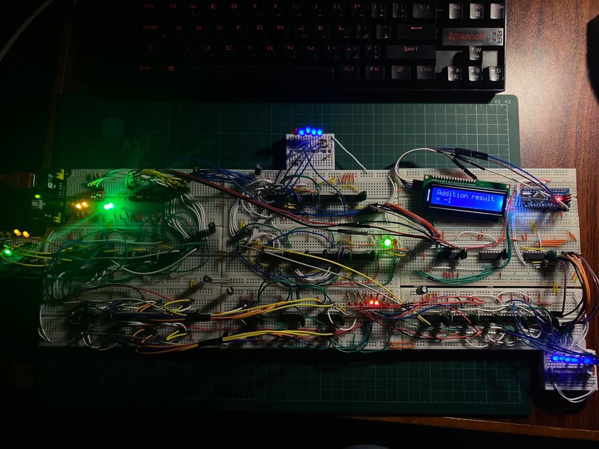
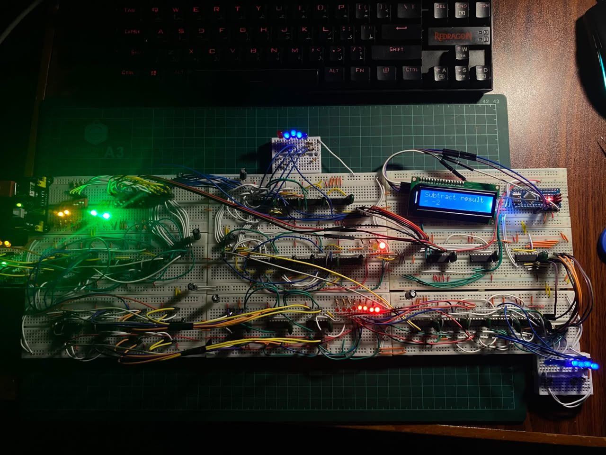
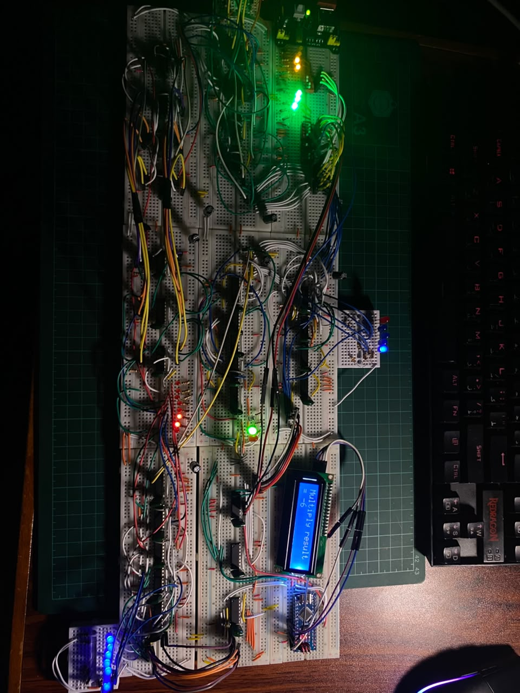
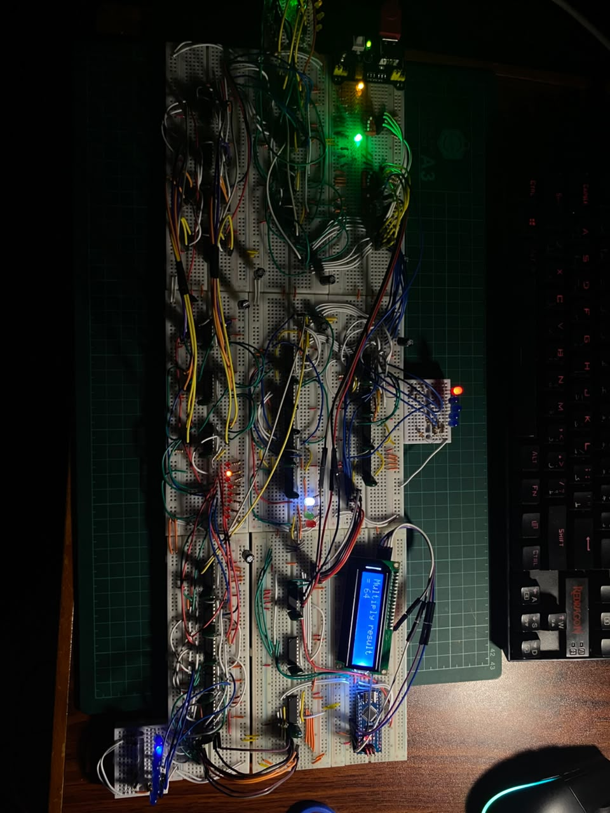

# Breadboard Testing

This folder contains photographs of the physical breadboard implementation of the 4-bit signed ALU.

Each test verifies that the hardware produces the correct binary result and that the Arduino Nano correctly reads the ALU outputs through the three `74HC165` shift registers and displays the signed decimal result on the LCD.

The ALU uses 4-bit two's complement inputs:

| Binary range | Decimal range |
|---|---:|
| `0000` to `0111` | `0` to `7` |
| `1000` to `1111` | `-8` to `-1` |

## Tested operations

| Test | A | B | Operation | Expected result | Status |
|---|---:|---:|---|---|:---:|
| Addition | `0011` = 3 | `1100` = -4 | `3 + (-4)` | `1111` = -1 | Passed |
| Addition overflow | `0111` = 7 | `0010` = 2 | `7 + 2` | `1001` = -7, overflow active | Passed |
| Subtraction | `0011` = 3 | `0101` = 5 | `3 - 5` | `1110` = -2 | Passed |
| Subtraction overflow | `1000` = -8 | `0001` = 1 | `-8 - 1` | `0111` = 7, overflow active | Passed |
| Comparison | `0101` = 5 | `1101` = -3 | `A > B` | A is greater | Passed |
| Comparison | `1011` = -5 | `1101` = -3 | `A < B` | A is less | Passed |
| Multiplication | `0011` = 3 | `1110` = -2 | `3 × (-2)` | `11111010` = -6 | Passed |
| Multiplication edge case | `1000` = -8 | `1000` = -8 | `(-8) × (-8)` | `01000000` = 64 | Passed |

---

## Addition

### `3 + (-4) = -1`

Inputs:

```text
A = 0011 = 3
B = 1100 = -4
SEL = 00
SUB = 0
```

Expected output:

```text
1111 = -1
Overflow = 0
```



### Addition overflow: `7 + 2`

Inputs:

```text
A = 0111 = 7
B = 0010 = 2
SEL = 00
SUB = 0
```

The mathematical result is `9`, which is outside the 4-bit signed range of `-8` to `7`.

The hardware output wraps to:

```text
1001 = -7
Overflow = 1
```


---

## Subtraction

### `3 - 5 = -2`

Inputs:

```text
A = 0011 = 3
B = 0101 = 5
SEL = 01
SUB = 1
```

Expected output:

```text
1110 = -2
Overflow = 0
```



### Subtraction overflow: `-8 - 1`

Inputs:

```text
A = 1000 = -8
B = 0001 = 1
SEL = 01
SUB = 1
```

The mathematical result is `-9`, which is outside the 4-bit signed range.

The hardware output wraps to:

```text
0111 = 7
Overflow = 1
```


---

## Signed comparison

### `5 > -3`

Inputs:

```text
A = 0101 = 5
B = 1101 = -3
SEL = 10
```

Expected comparison outputs:

```text
GT = 1
EQ = 0
LT = 0
```


### `-5 < -3`

Inputs:

```text
A = 1011 = -5
B = 1101 = -3
SEL = 10
```

Expected comparison outputs:

```text
GT = 0
EQ = 0
LT = 1
```


---

## Signed multiplication

### `3 × (-2) = -6`

Inputs:

```text
A = 0011 = 3
B = 1110 = -2
SEL = 11
```

Expected 8-bit product:

```text
11111010 = -6
```



### Edge case: `(-8) × (-8) = 64`

Inputs:

```text
A = 1000 = -8
B = 1000 = -8
SEL = 11
```

Expected 8-bit product:

```text
01000000 = 64
```



---

## Test conclusion

The physical implementation successfully performs:

- 4-bit signed addition
- 4-bit signed subtraction
- Signed overflow detection
- Signed comparison
- 4-bit by 4-bit signed multiplication with an 8-bit result
- Binary-to-signed-decimal display using an Arduino Nano and LCD

The tests include positive operands, negative operands, mixed-sign operations, overflow conditions, and the `-8 × -8` multiplication edge case.
